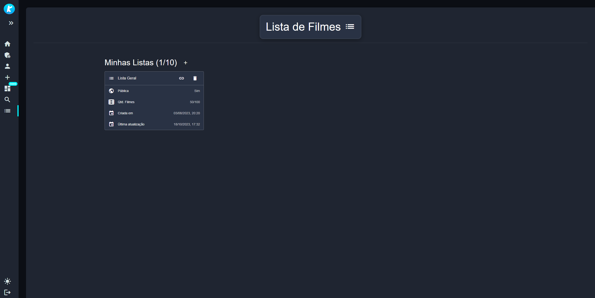

# Movie Mux - Movie Rating Portal

## Introduction:

This is a personal project aimed at creating a comprehensive movie rating portal. Whether you're a movie buff or simply looking for a way to discover new films.

Inspired by IMDB and TMDB.

## Inspiration:

The project takes inspiration from renowned platforms such as IMDB (Internet Movie Database) and TMDB (The Movie Database), aiming to provide a comparable range of features and functionalities.

## Technologies

```
Vue.js, Java, Spring Boot, Lombok, Hibernate, Apache Maven, PostgreSQL, Discord API, Git, Github, Docker, Angular 16, Bootstrap, NodeJS, ExpressJS, Axios,Typescript, Prisma, SQLite, HTML, CSS, SASS, VSCode, Quasar Framework, TypeORM, Socket.io, Kotlin, Spring Cloud Gateway, Spring Webflux, Redis, Nginx...
```

<div >
	
	
	
	
	
	
	
	
	
	
	
	
	
	
	
	
	
	
	
	
	
	
	
  
  
</div>

## Images

<p align="center">
Home Page
</p>
<p align="center">
  
</p>

<p align="center">
Movie Page
</p>
<p align="center">
  
</p>

<p align="center">
Discover Page
</p>
<p align="center">
  
</p>
<p align="center">
  
</p>

<p align="center">
Movie Watchlist Page
</p>
<p align="center">
  
</p>
<p align="center">
  
</p>

<p align="center">
Dashboard
</p>
<p align="center">
  
</p>

### Website (Access by invitation only):

[Movie Mux](https://www.moviemux.com)

### Project Ecosystem:

[Movie Mux Back-End](https://github.com/HenriqueMendesCoelho/cine-kronusBoss-api) - A corresponding backend project complements the frontend, ensuring the cohesive operation of the movie rating portal.<br>
[Movie Mux Socket.io Back-End](https://github.com/HenriqueMendesCoelho/moviemux-websocket) - Designed and implemented a real-time update system using Socket.io<br>
[Movie Mux Gateway](https://github.com/HenriqueMendesCoelho/moviemux-gateway) - The gateway serves as a single entry point for all client requests, routing them to the appropriate backend services.

External integration aggregator projects<br>
[Kronus Integration Tool Front-End](https://github.com/HenriqueMendesCoelho/kronus-integration-tool-frontend)<br>
[Kronus Integration Tool Back-End](https://github.com/HenriqueMendesCoelho/kronus-integration-tool-api)

### This product uses the TMDB API but is not endorsed or certified by TMDB.
